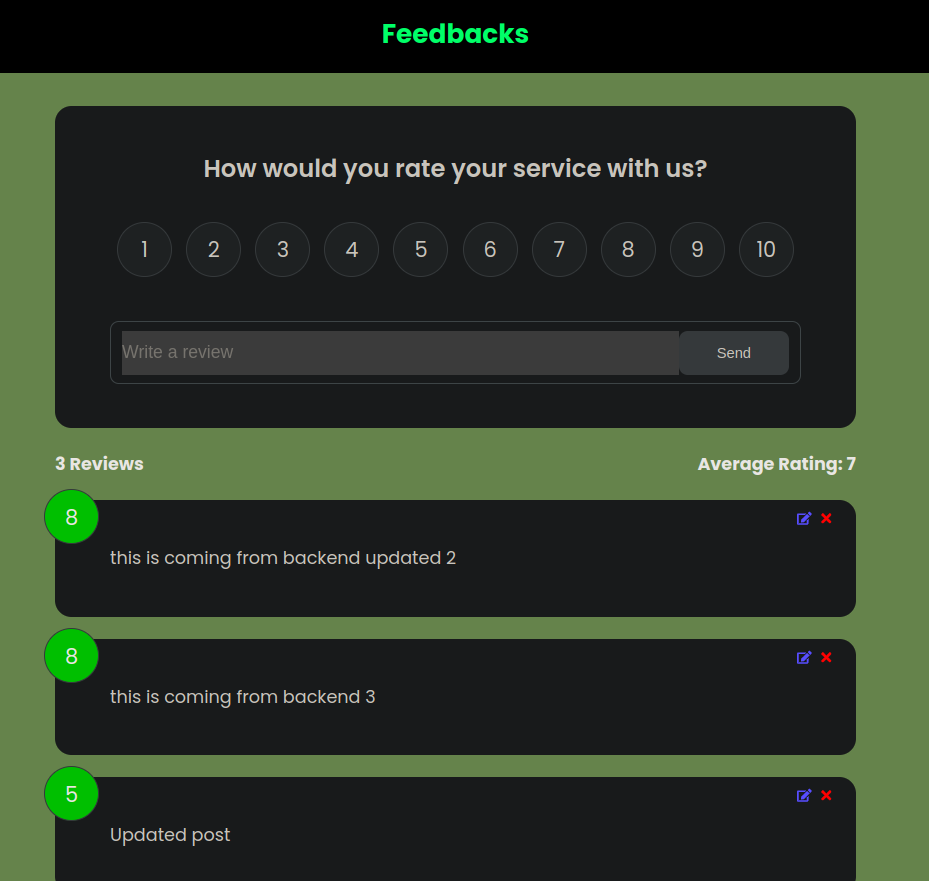

# React + TypeScript + Vite Feedback App



This project is part of my React portfolio. It is a simple FeeedBack App that uses json-server for backend side.

## Table of Contents

- [Features](#features)
- [Installation](#installation)
- [Run the Application](#run-the-application)

### Features

<a name="features"></a>

- Easy-to-use and user-friendly interface.
- Clean and intuitive design.
- Responsive layout for mobile and desktop.
- Built with (React, TypeScript.js)
- Utilizes Json-Server and ContextApi for state management.

### Installation

<a name="installation"></a> 3. Install Dependencies (frontend & backend):

```bash
npm install
```

### Run the Application

<a name="run-the-application"></a>

```bash
# Run frontend (:3000) & backend (:5000)
npm run app

# Run backend only
npm run server

```

5. BUILD & DEPLOY

```bash
# Create frontend prod build
npm run build
```
